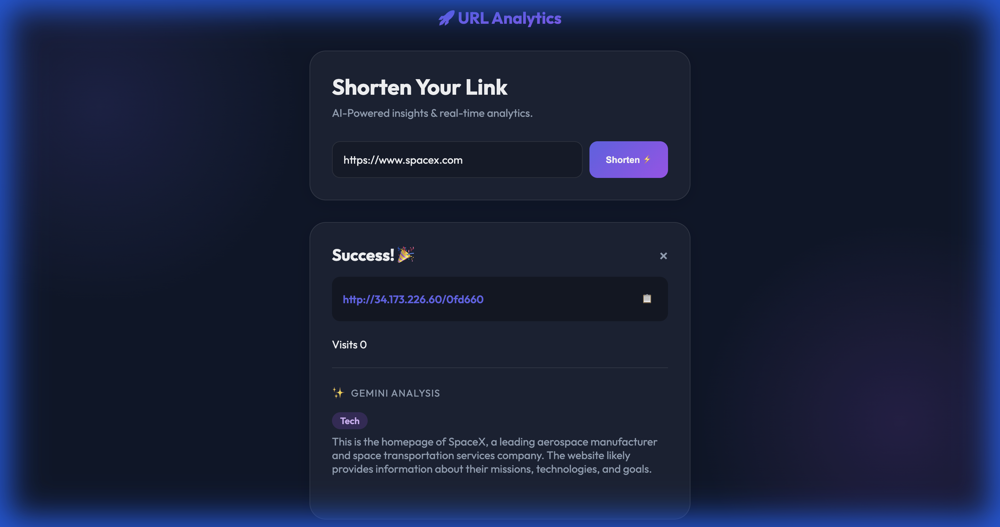
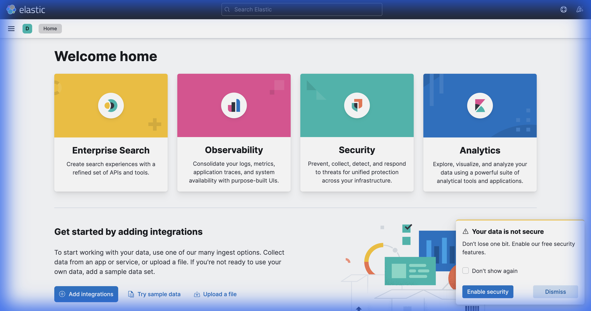

# 🚀 Cloud-Native URL Analytics Platform

**A scalable, containerized URL shortening service with real-time analytics, AI insights, and centralized observability.**


---

## 🧠 What is this?

This project is a **production-ready demonstration** of modern DevOps and Cloud-Native practices. It is not just a URL shortener; it is a full-stack engineering showcase that mimics large-scale system architectures using **Free-Tier** resources.

### ✨ Key Features
*   **🔗 URL Shortening**: Deterministic short codes using MD5 hashing.
*   **⚡ Ultra-Fast Caching**: **Redis** is used for caching hot URLs and counting hits in real-time.
*   **🤖 AI-Powered Insights**: Integrates **Google Vertex AI (Gemini Pro)** to automatically categorize and summarize the content of shortened links in the background.
*   **👁️ Centralized Observability**: Full **ELK Stack (Elasticsearch, Logstash, Kibana)** integration for structured logging and traffic visualization.
*   **☁️ Infrastructure as Code**: Entire GCP infrastructure (Compute, Network, Firewall) provisioned via **Terraform**.
*   **🔄 CI/CD Pipeline**: Fully automated **GitHub Actions** workflows for Linting, Docker Build, Security Scanning (Trivy), and Terraform Deployment.

---

## 📸 Screenshots

### Web Application
*The modern, responsive interface for shortening URLs.*


### Kibana Dashboard
*Real-time visibility into traffic, latency, and system health.*


### Redis Commander
*Direct access to the caching layer for debugging.*


---

## 🏗️ Architecture

1.  **Application**: Python FastAPI (High performance, Async).
2.  **Data Layer**: Redis (Primary store for mappings and active analytics).
3.  **Intelligence**: Google Vertex AI (Gemini Pro) for content classification.
4.  **Logging**: Python App -> Logstash (TCP) -> Elasticsearch -> Kibana.
5.  **Infrastructure**: Docker Containers running on Google Compute Engine (`e2-standard-2`).

---

## 🛠️ Build & Debug Log

A transparent record of the challenges faced and solutions implemented during the development of this platform.

| Component | Issue Encountered | Root Cause | Fix Implemented |
|-----------|-------------------|------------|-----------------|
| **Terraform** | `403 Forbidden` during apply | Missing API permissions | Enabled `compute.googleapis.com` and `artifactregistry.googleapis.com` via `gcloud`. |
| **Docker** | `Permission Denied` pulling image | VM Service Account Scope | Updated Terraform to attach `cloud-platform` scope to the VM Instance. |
| **GCP VM** | Container Crash / OOM | `e2-micro` (1GB RAM) too small for ELK | Upgraded instance to `e2-standard-2` (8GB RAM). |
| **Elasticsearch** | Failed to start | OS Limit `vm.max_map_count` too low | Added `sysctl -w vm.max_map_count=262144` to startup script. |
| **Kibana** | `Connection Refused` on Port 5601 | Default binding to `localhost` | Updated `kibana.yml` to bind `server.host: "0.0.0.0"` + Firewall Rule. |
| **Logstash** | Index not created in ES | No traffic/logs sent initially | Generated test traffic to trigger index creation (`logstash-*`). |
| **Redis UI** | Requested feature missing | Service not defined in Compose | Added `redis-commander` container and opened Port 8081. |
| **CI Pipeline** | Pylint Import Errors | Missing dependencies in CI env | Updated `ci.yml` to `pip install -r requirements.txt` before linting. |

---

## 🚀 Getting Started (Live)

The application is currently deployed and active on Google Cloud:

*   **Web App**: [http://34.173.226.60](http://34.173.226.60)
*   **Kibana**: [http://34.173.226.60:5601](http://34.173.226.60:5601)
*   **Redis UI**: [http://34.173.226.60:8081](http://34.173.226.60:8081)

---

## ☁️ Deployment (GCP)

This project uses **Terraform** to provision infrastructure on Google Cloud Platform.

1.  **Set Secrets in GitHub**:
    *   `GCP_CREDENTIALS`: Your Service Account JSON.
    *   `TF_VAR_project_id`: Your GCP Project ID.
    *   `SSH_PRIVATE_KEY`: Private key for VM access.
    *   `SSH_USERNAME`: SSH Username (e.g., `runner`).
    *   `VM_IP`: The static IP (after first run).
2.  **Push to Main**:
    *   GitHub Actions will trigger the **CD Pipeline**.
    *   Terraform `plan` and `apply` will run automatically.

---

## 📂 Project Structure

```bash
.
├── app/                 # FastAPI Application & Dockerfile
├── elk/                 # Logstash & Kibana Configuration
├── terraform/           # IaC for GCP (Compute, VPC, Firewall)
├── .github/workflows/   # CI/CD Pipelines
├── docker-compose.yml   # Local Development Setup
├── docker-compose.prod.yml # Production Stack
└── README.md
```
